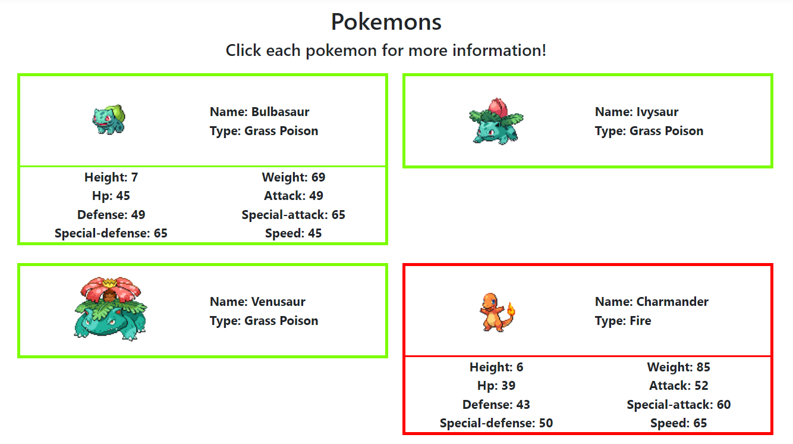
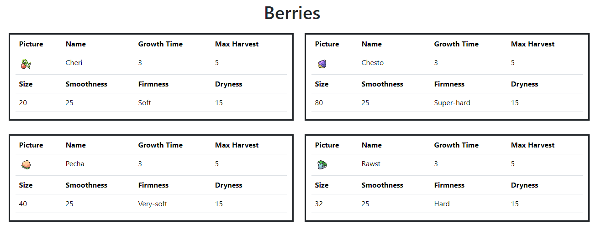
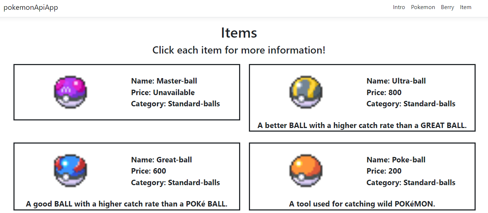

<h1 align="center"> Online Pokédex</h1>
<h3 align="center">https://poke-api-final.vercel.app/</h3>

This program implement public API to provide information and statistics of each Pokémon, items, and berries for Pokémon trainers

<h2 align="center">Pokémon</h2>

 
  

<h2 align="center">Berries</h2>

 
  

<h2 align="center">Items</h2>

 
  

